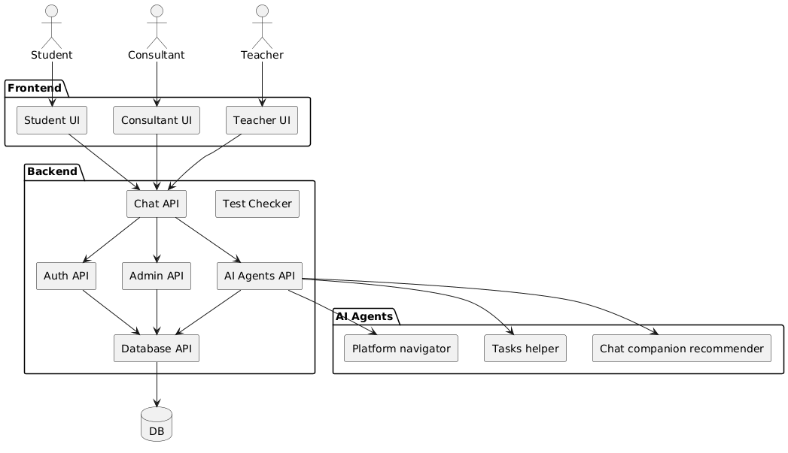

# Техническое задание: Интеллектуальные помощники для обучающих платформ

## 1. Цель проекта

Проект направлен на создание набора интеллектуальных помощников, которые анализируют обращения пользователей и документацию информационных систем, ищут аналогичные кейсы и предлагают готовые решения. В нашем случае ассистенты применяются на обучающей платформе для подготовки к ЕГЭ (например, Фоксфорд). 

Ассистент должен помогать студентам и преподавателям решать типовые задачи:
- Навигация по сайту
- Поиск расписания и материалов
- Проверка тестов
- Связь с преподавателем
- Ускорение закрытия обращений/инцидентов

## 2. Пользователи

- **Пользователь-студент**: проходит курсы подготовки к ЕГЭ/ОГЭ, ищет материалы, задаёт вопросы (Продукт 2)
- **Консультант/преподаватель**: отвечает на сложные вопросы, контролирует качество ответов, обновляет базу знаний (Продукт 1)

## 3. Основные функции

### Навигация и связь
- Отвечать на вопросы о навигации по сайту
- Помогать с расписанием курсов
- Содействовать связи с преподавателем

### Анализ запросов и поиск похожих случаев
- Анализировать текст обращения и документацию
- Искать похожие обращения/кейсы
- Предлагать готовое решение с ссылками на документы

### Помощь с тестами
- Принимать ответы студентов на бумажные или онлайн-тесты
- Сверять их с правильными ответами
- При типовых вопросах выдавать правильный ответ и ссылку на объяснение
- *Примечание*: Полноценное обучение модели для решения любых тестов не входит в MVP

### Эскалация
- При неуверенности ассистента или нестандартном вопросе автоматически передавать запрос консультанту/преподавателю
- Прикреплять контекст: вопрос, найденные фрагменты, черновик ответа

### История и поиск
- Хранить историю диалогов и оценок
- Находить похожие вопросы
- Улучшать базу знаний

### Дополнительные идеи
- **Трекинг прогресса**: анализировать успехи студента на тестах и предлагать дополнительные материалы и вебинары
- **Аналитика для консультантов**: выделять часто встречающиеся вопросы и темы, рекомендовать обновление документации и материалов

## 4. Функциональные требования

### Общие требования

| ID | Требование | Приоритет |
|---|---|---|
| FR-G-01 | Система должна вести журнал всех диалогов (вопрос, ответ, время, канал, оценка, эскалация) | Must |
| FR-G-02 | Каждый ключевой фрагмент ответа должен сопровождаться ссылкой на источник; если цитаты нет, бот должен предложить эскалацию | Must |
| FR-G-03 | Интерфейсы должны поддерживать несколько языков (RU/EN) | Should |
| FR-G-04 | Эскалация должна создавать тикет/уведомление с прикреплением контекста (вопрос, найденные фрагменты, черновик ответа) | Must |

### Продукт 1 – для консультантов

| ID | Требование | Приоритет |
|---|---|---|
| FR-P1-01 | Предоставлять полнотекстовый поиск по базе знаний и обращениям; выдавать топ-k фрагментов (text, source, score) | Must |
| FR-P1-02 | Генерировать структурированный ответ для консультанта: разделы Steps, Risks, Checklist и список использованных источников | Must |
| FR-P1-03 | Отображать историю запросов с фильтрацией по дате, теме, статусу | Should |
| FR-P1-04 | Обеспечивать возможность эскалации и обратной связи (полезно/неполезно) по каждому ответу | Must |

### Продукт 2 – для пользователей

| ID | Требование | Приоритет |
|---|---|---|
| FR-P2-01 | Отвечать на типовые вопросы простым языком с нумерованными шагами; предоставлять кнопку «помогло/не помогло» | Must |
| FR-P2-02 | При отсутствии уверенности или цитат предлагать эскалацию и собирать минимальные контактные данные | Must |
| FR-P2-03 | Сверять ответы студентов на тестовые вопросы, если вопрос типовый; при возможности возвращать правильный ответ и ссылку на объяснение | Should |
| FR-P2-04 | Предоставлять публичные ссылки на документы/FAQ, скрывая внутренние ссылки | Should |

## 5. Нефункциональные требования

| ID | Категория | Требование |
|---|---|---|
| NFR-01 | Производительность | Время до первого токена ответа ≤ 3 с; полный ответ ≤ 12 с |
| NFR-02 | Доступность | Доступность сервиса ≥ 99% в рабочие часы |
| NFR-03 | Безопасность/приватность | Не хранить персональные данные пользователей; доступ к внутренним источникам возможен только у консультантов по ролям |
| NFR-04 | Аудит | Все эскалации и действия должны трассироваться |
| NFR-05 | Юзабилити | Интерфейсы должны быть адаптивными для desktop и mobile и обеспечивать базовую доступность (контраст, aria-labels) |

## 6. Основные сценарии

### UC-P1-01: Работа консультанта
1. Консультант вводит запрос
2. Система возвращает топ-k фрагментов с оценками
3. Консультант выбирает фрагменты и нажимает «Собрать ответ»
4. Получает структурированный ответ и список источников
5. Оценивает ответ или эскалирует

### UC-P2-01: Работа пользователя
1. Пользователь задаёт вопрос
2. Бот возвращает краткий ответ с шагами
3. Пользователь отмечает «помогло/не помогло»
4. При отрицательной оценке бот предлагает эскалацию и собирает контактную информацию

### UC-P2-02: Проверка тестов
1. Пользователь вводит ответы на тест
2. Бот сверяет ответы и возвращает правильные с объяснениями
3. При неопределённости предлагает обратиться к преподавателю

## 7. Данные и сущности

### Dialog
- `id` - уникальный идентификатор
- `канал` - P1|P2
- `user_id` - идентификатор пользователя (опционально)
- `question` - вопрос пользователя
- `answer` - ответ системы
- `created_at` - время создания
- `rating` - оценка ответа
- `escalation_id` - идентификатор эскалации (опционально)

### Snippet
- `id` - уникальный идентификатор
- `dialog_id` - идентификатор диалога
- `source_id` - идентификатор источника
- `text` - текст фрагмента
- `score` - оценка релевантности
- `offset` - смещение в источнике

### Source
- `id` - уникальный идентификатор
- `type` - тип источника (FAQ|PDF|KB)
- `title` - заголовок
- `url/path` - URL или путь к файлу
- `version` - версия
- `visibility` - видимость

### Escalation
- `id` - уникальный идентификатор
- `dialog_id` - идентификатор диалога
- `target` - цель эскалации (queue/email/bot)
- `status` - статус
- `payload_ref` - ссылка на данные
- `created_at` - время создания

## 8. Интерфейсы (API черновик)

### Продукт 1 API

#### POST /search
**Параметры**: `query`, `k`  
**Ответ**: список snippets `{text, source, score}`

#### POST /compose
**Параметры**: `query`, `snippets[]`  
**Ответ**: разделы `steps[]`, `risks[]`, `checklist[]`, `citations[]`

#### POST /feedback
**Параметры**: `dialog_id`, `rating` (±1), `comment?`  
**Ответ**: статус

#### POST /escalate
**Параметры**: `dialog_id`, `reason`, `contact?`  
**Ответ**: `ticket_id`

### Продукт 2 API

#### POST /chat
**Параметры**: `message`, `locale?`  
**Ответ**: stream ответов или объект `{answer, can_escalate}`

#### POST /escalate
**Параметры**: `message`, `contact`  
**Ответ**: `ticket_id`

## 9. Критерии приёмки

- **Поиск**: при запросе на тестовом корпусе возвращается ≥ 3 фрагментов с полями text, source, score
- **Сборка ответа (P1)**: ответ содержит разделы Steps, Risks, Checklist и хотя бы две цитаты
- **Эскалация (P2)**: при низкой уверенности бот явно предлагает эскалацию и собирает контактную информацию
- **Помощь с тестами**: при типовом вопросе бот возвращает правильный ответ и ссылку на объяснение

## 10. Допущения и ограничения

- База знаний и документы предоставляются владельцами платформы; доступ к материалам и расписанию через API
- Ассистент не заменяет преподавателя: для вопросов без типовых решений всегда предусмотрена эскалация
- Сверка ответов на тесты не гарантирует 100%-ную точность и используется как подсказка

## 11. Риски

| Риск | Решение |
|---|---|
| Галлюцинации модели | Решается через требование наличия цитат и возможность эскалации |
| Неполная база знаний | Необходима регулярная доиндексация и пометки «пробелов» |
| Перегрузка сервиса | Требуется использование кэша, троттлинга и оптимизации |
| Конфиденциальность | Нужно исключить попадание персональных данных в логи и ответы |

## 12. Архитектура проекта

### Диаграмма компонентов

### Диаграмма развертывания

### Диаграмма вариантов использования

## 12. Используемые технологии

### Front End

* HTML/CSS/JS
* Vue framework

### Backend

* API: Fast API

### Database

* PostgresSQL

### ML

* Opensourse LLM: Llama 3.1
* Additional training: Python + Numpy + Torch
