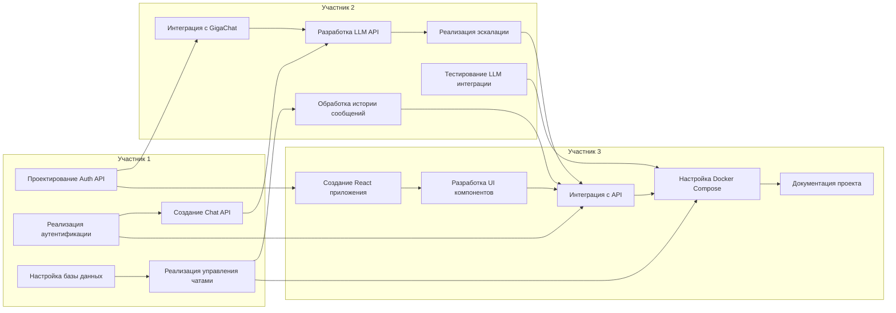

# Диаграмма активности проекта

```mermaid
flowchart LR
    subgraph A[Участник 1]
        A1[Проектирование Auth API]
        A2[Реализация аутентификации]
        A3[Создание Chat API]
        A4[Реализация управления чатами]
        A5[Настройка базы данных]
    end

    subgraph B[Участник 2]
        B1[Интеграция с GigaChat]
        B2[Разработка LLM API]
        B3[Реализация эскалации]
        B4[Обработка истории сообщений]
        B5[Тестирование LLM интеграции]
    end

    subgraph C[Участник 3]
        C1[Создание React приложения]
        C2[Разработка UI компонентов]
        C3[Интеграция с API]
        C4[Настройка Docker Compose]
        C5[Документация проекта]
    end

    A1 --> B1
    A1 --> C1
    A2 --> A3
    A3 --> B2
    B1 --> B2
    B2 --> B3
    A4 --> B4
    A5 --> A4
    C1 --> C2
    C2 --> C3
    A2 --> C3
    B3 --> C3
    B4 --> C3
    C3 --> C4
    B5 --> C4
    A4 --> C4
    C4 --> C5
```

