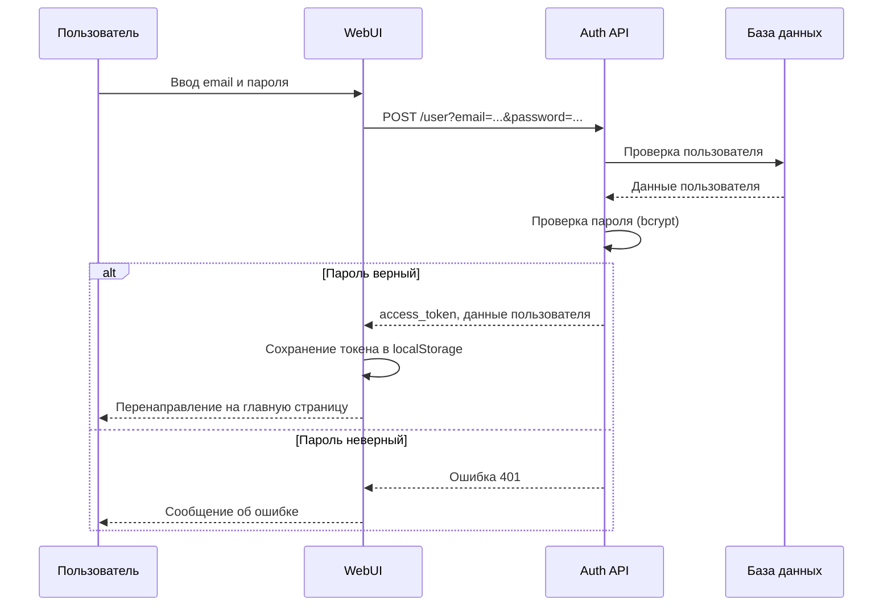
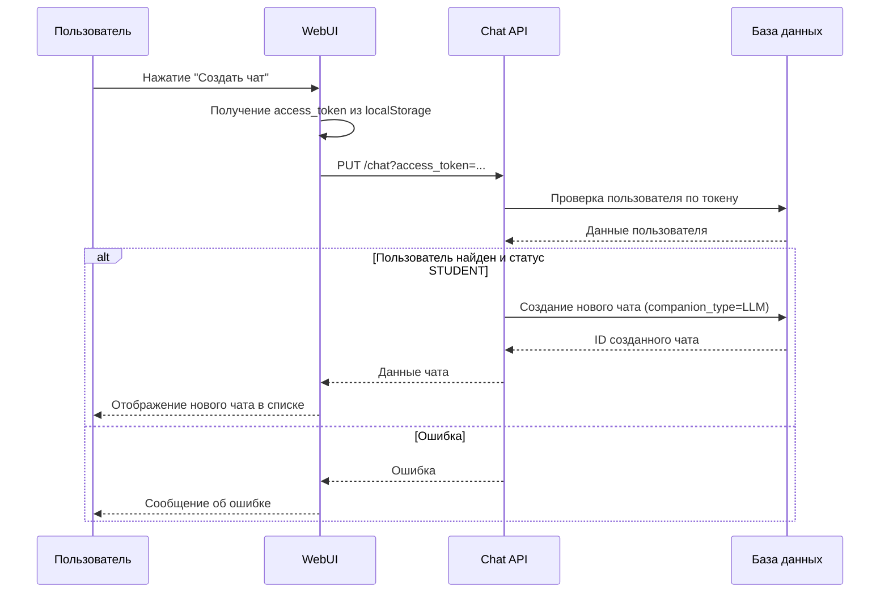
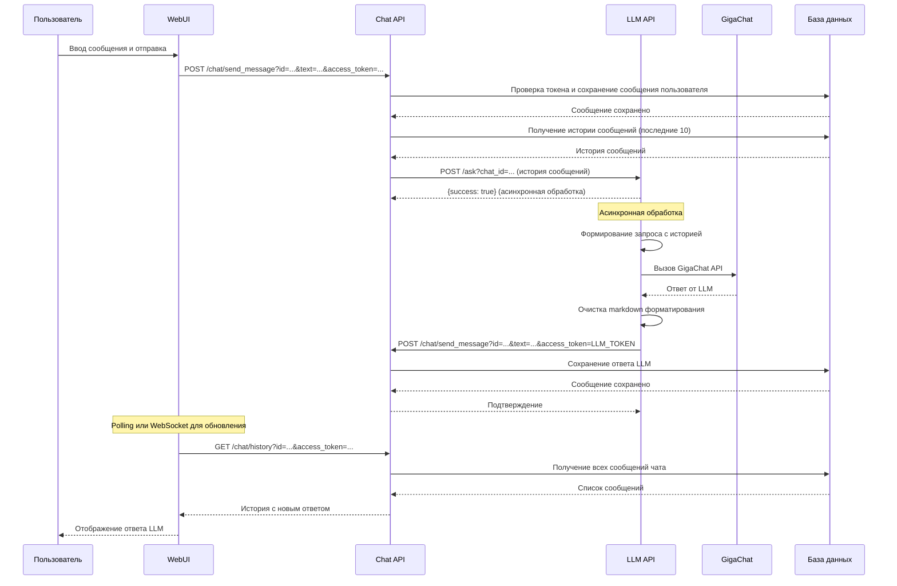
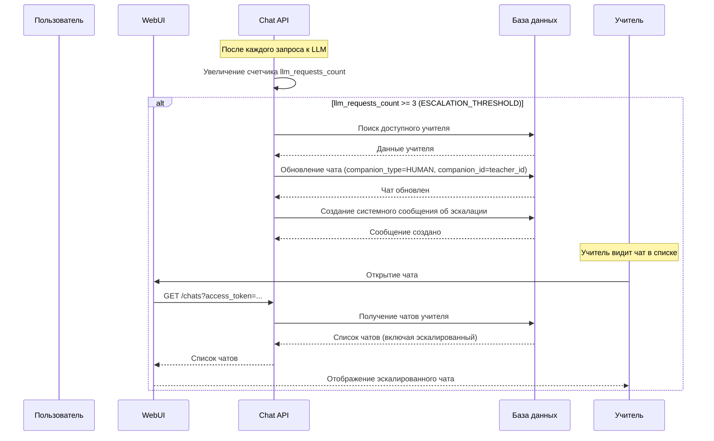
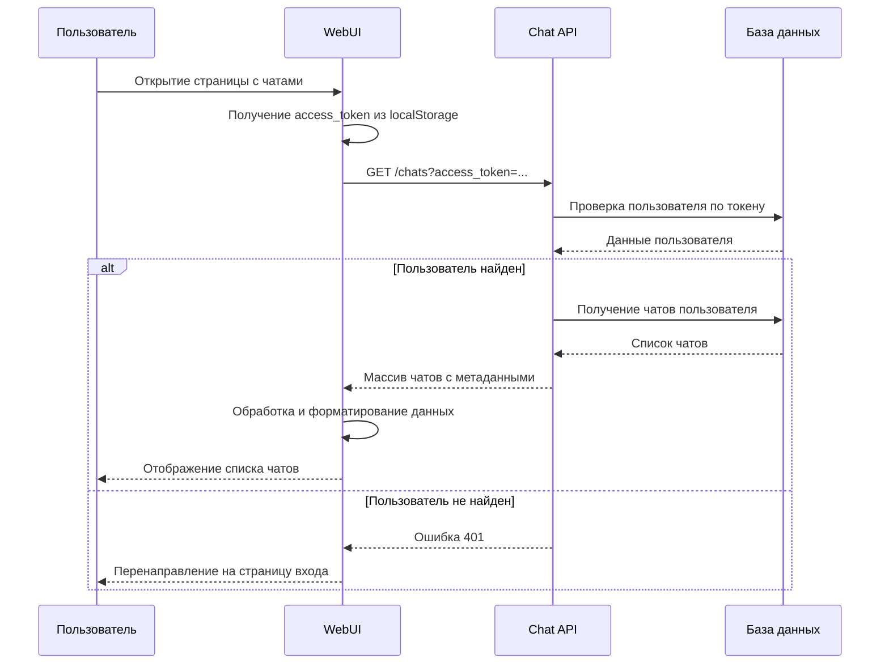

# Диаграммы последовательностей проекта

## Сценарий 1: Авторизация пользователя

## Сценарий 2: Создание нового чата

## Сценарий 3: Отправка сообщения и получение ответа от LLM

## Сценарий 4: Эскалация чата к учителю

## Сценарий 5: Получение списка чатов

