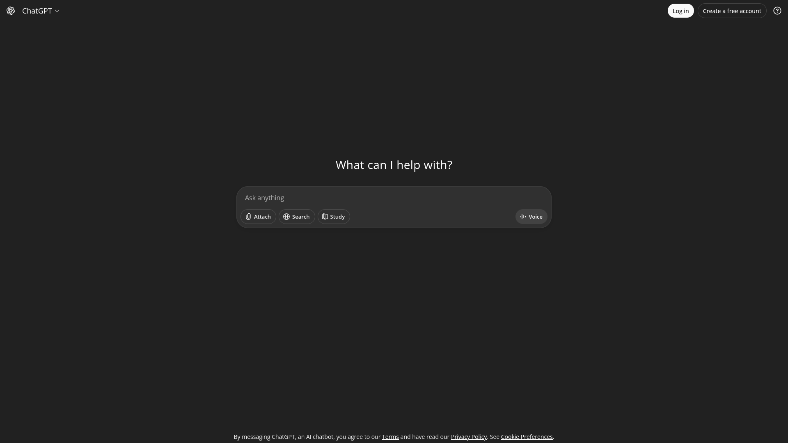

# Спринт 5

## Скрам

Андрей

## Цель

Cделать демо приложения

## Задачи

### То, что нужно доделать с прошлых спринтов:

* Добавить в репозиторий [Диаграмму активности](https://img.plantuml.biz/plantuml/svg/xLR1Qjj04BqBz0zpj6aWT_lGzD9JAVJG3mXK8GOt3R5AhxAKkYqn5Yc1G20j_O22ubgn8aNsB-p-Gh-aRsObMQwLGaakXHv2TaUpRzwyULfhP-3k7hblN_Tjo-svVOVKXSfKf8Twg19zh1ALOZV2EYGrLv5QQayjy72XfgIM-9VfCHvWYpnVnTY7jcLRWikB8-VGsSMgexusPeyDxWo1K-qJdYpA8bq-zKLsCHAG3Hu-Je1U88jwjegezVpPIzecYKHubd0lxIxJwErHIrqMqHzbJu_RvEux1tY4-ctR8Z8q4y2b97Kp_86joi4troVwFLVtfK2El17NIt4anv4bSbFaeRykWrL5RuG-ZZTYgjY4vpfWGH24EFfaarn93pDXqOmM3IUf9MGIcLEwHOM4KsHCjfZ_44Kpm2JjRXstLDAeZEM8MQEbe5CCcsiXik2kS_1UZnPWqlQTqvv9m9pActfaDkVeCDKUzFPBXnJawATt9YEGLWCzx8W4-gDGBIaG3TmtXsRjz0SE2e2kzcibllECWPkj38wHGp6UBlISyNovzoR8WrUzFLusO1loit8y0Vj1Vy2SGptHdm1visRRkzwYYPGj2jaM5n9TBzXhh0sN5FVyXhTDJv-y-BEn-Tsz4W_599CJBmD8pgwiUyQ0HcdJ0mRFW5YOLu61JjLvirC_Wrif0wiAbg1CZse6r07RA2BcLTM0wFzT-O-vyXBKheq_fkfM6g_45Lc0tT26YfgC-WqbvokklcIoTMIyaN4io9S_1fketPNZwtSb4nHs7coahlWIH--nNEGGEk7eDH3OuZ4I5-obgToTjvnGcNYjmeFuyvxklBytInirUkTlNLc1rOqYluK9cF4dHGWFYfQUiCZDJQF7XGKUpAmL0_CTGk_sUtsdPjZ8Y6i6mZueD1UBXPkr8p4AjiS8U_18zILXMpie9fzIjlKB)
* Сделать Диаграмму классов (domain model)
* Сделать Диаграмму последовательностей (Sequence)
* Архитектуру проектов?
* Создать и отметить задачи, которые мы выполняли в течение начала семестра

### То, что нужно сделать за этот спринт

#### Front end

1. Создание макета приложения, ожидаемый вид примерно как у 
2. Создание WebUI, ожидаемый функционал:
	1. `/` - главная страница, будет менять в зависимости, кто авторизировать, студент, учитель или же ассистент. Доступ к главной странице должен предоставлять только авторизированным пользователям, если неавторизированный пользователь заходит на эту стрианицу, его переадресует на страницу `/auth`. Так же должна будет меняться ссылка(без перезагрузки страницы) на `/?chat=<chat_id>`, и если переходить по такой ссылке, должен открываться чат именно с таким id (если к нему есть доступ, если нет, то страница с ошибкой 404)
		* **Студент**: Чат по центру (функционал: отправление сообщение, получение сообщений(как это реализовывать - решает программист, варианты: раз в 5 секунд отправлять запрос на загрузку истории чата и обновлять либо один раз отправлять такой запрос, устанавливать websocket соединение и таким образом принимать сообщения)), слева-сверху список чатов и кнопка создания нового + возможность сменить название чата (новое название должен видеть только пользователь) и удалить его, справа-сверху Кнопки `Смена аккаунта` и `Профиль`.
		* **Учитель**: Чат по центру (функционал: отправление сообщение, получение сообщений(как это реализовывать - решает программист, варианты: раз в 5 секунд отправлять запрос на загрузку истории чата и обновлять либо один раз отправлять такой запрос, устанавливать websocket соединение и таким образом принимать сообщения)), слева-сверху список чатов, фильтр чатов по конкретному студенту и статусу (открытый, удаленный) и возможность сменить название (новое название должен видеть только учитель). Создание и удаление чата учителем не предусмотрено, но удаленные чаты должны помечаться, справа-сверху Кнопки `Смена аккаунта` и `Профиль`.
		* **Ассистент**: Чат по центру (функционал: отправление сообщение, получение сообщений(как это реализовывать - решает программист, варианты: раз в 5 секунд отправлять запрос на загрузку истории чата и обновлять либо один раз отправлять такой запрос, устанавливать websocket соединение и таким образом принимать сообщения)), слева-сверху список чатов + возможность сменить название чата (новое название чата будет видно только ассистенту). Создание и удаление чатов ассистентом не предусмотрено, справа-сверху Кнопки `Смена аккаунта` и `Профиль`.
	2. `/auth` - страница авторизации, для демо пока будем использовать страндартные Email+Пароль. Создание аккаунта перекладывается на руки поддержки (не будет функционала создания аккаунта)
	3. `/user` - страница информации пользователя. Email, Имя, Фамилия, статус (Студент/Поддержка/Учитель), описание.
	4. `/settings` - страница настроек. Должна поддерживаться смена пароля (то есть форма с полями `Прошлый пароль`, `Новый пароль`, `Подтверждение пароля`, отпралять запрос можно только при совпадении значений в последних двух полях).
	5. `/manage` - страница с доступом только для поддержки. Функционал: добавить пользователя/учителя (поля Email+Имя+Фамилия, разовый пароль генерируется автоматически и возвращается поддержке, чтобы его можно было пислать пользователю (в идеале, настроить, чтобы этот пароль присылался через email, что будет огромным плюсом, но пока для демо об этом не думаем)), удалить пользователя/учителя

Реализация:
* Бекенд на Flask (работа с куки для авторизации, возвращение нужных html-ек по соответсвующим запросам)
* Frontend - HTML/JS/CSS/Flask templates

#### Backend

Реализация нескольких разных api сервисов

##### Auth API

Поля пользователя в базе данных:

* `id` - уникальный идентификатор пользователя
* `email` - уникальный email пользователя, указываемый при создании аккаунта
* `first_name` - имя пользователя
* `last_name` - фамилия пользователя
* `status` - статус пользователя (STUDENT/TEACHER/ASSITENT)
* `description` - описание пользователя
* `password_hash` - хеш пароля (не возарщается, используется для проверки авторизации)
* `access_token` - длинный уникальный токен доступа пользователя, в котором зашифрована строка `id+email+password_hash`

###### **GET** `/user`

Поиск пользователя по имени и паролю. Возвращает информацию о пользователе.

Приходит:

```json
{
	"email": "...",
	"password": "...",
}
```

Возвращаем:

```json
{
	"success": true,
	"error": "Error description",
	"data": {
		"id": 123,
		"email": "...",
		"first_name": "...",
		"last_name": "...",
		"status": "...",
		"description": "...",
		"access_token": "...",
	}
}
```

###### **PUT** `/user`

Создание пользователя. `access_token` - токен авторизации пользователя. Данный метод должен быть доступен только для ассистентов. Возвращает информацию об обновленном пользователе вместе с паролем.

Приходит:

```json
{
	"first_name": "...",
	"last_name": "...",
	"status": "...",
	"access_token": "..."
}
```

Возвращаем:

```json
{
	"success": true,
	"error": "Error description",
	"data": {
		"id": 123,
		"email": "...",
		"first_name": "...",
		"last_name": "...",
		"status": "...",
		"description": "...",
		"password": "...",
		"access_token": "...",
	}
}
```

###### **UPDATE** `/user`

Обновление данных пользователя. `access_token` - токен авторизации пользователя. Данный метод должен быть доступен только для ассистентов и пользователей, чья информация обновляется

Приходит:

```json
{
	"email": "...",
	"password": "...",
	"access_token": "..."
}
```

Возвращаем:

```json
{
	"success": true,
	"error": "Error description"
}
```


###### **DELETE** `/user`

Обновление данных пользователя. `access_token` - токен авторизации пользователя. Данный метод должен быть доступен только для ассистентов. Возвращает информацию об удаленном пользователе.

Приходит:

```json
{
	"email": "...",
	"access_token": "..."
}
```

Возвращаем:

```json
{
	"success": true,
	"error": "Error description",
	"data": {
		"id": 123,
		"email": "...",
		"first_name": "...",
		"last_name": "...",
		"status": "...",
		"description": "...",
		"access_token": "...",
	}
}
```
